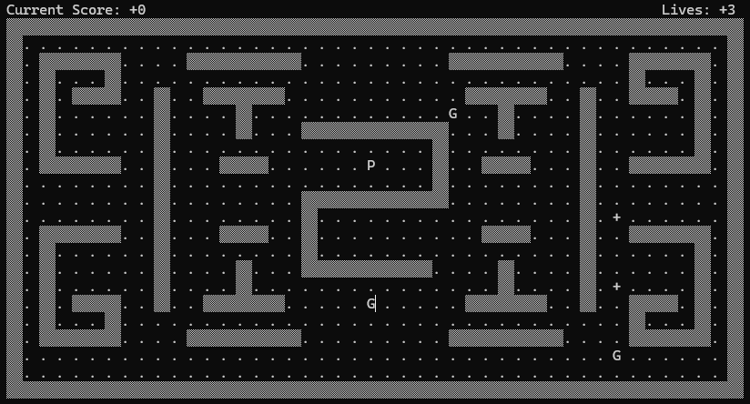
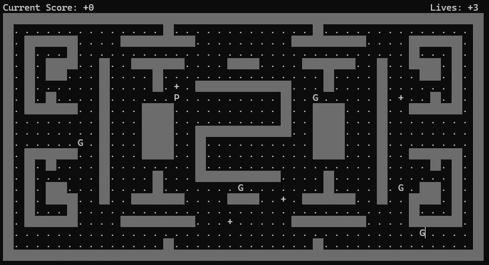
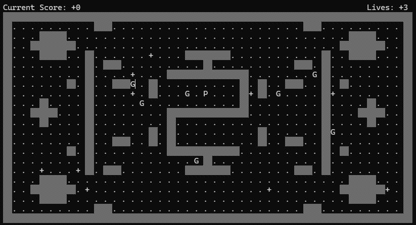

# ASM-Pacman

A classic Pacman game implemented in Assembly x86 using MASM.

## Game Description

ASM-Pacman is a faithful recreation of the iconic arcade game Pacman, built entirely in x86 Assembly language. Navigate through mazes, collect all the dots, avoid ghosts, and try to achieve the highest score possible!

## How to Play

- Use W, A, S, D keys to navigate Pacman through the maze
- Eat all the dots in the maze to complete a level
- Avoid ghosts - if they catch you, you lose a life
- Collect fruits that appear periodically for bonus points
- When all dots are eaten, you advance to the next level

## Game Mechanics

### Levels

The game features three distinct levels with increasing difficulty:

#### Level 1
- 3 ghosts with very slow movement speed
- Complex maze layout with multiple paths
- Perfect for beginners to learn the game mechanics

#### Level 2
- 5 ghosts with normal movement speed
- Complex maze layout similar to Level 1
- Increased challenge as ghosts move faster and in greater numbers

#### Level 3
- 7 ghosts with very fast movement speed
- Simpler maze layout compared to Levels 1 and 2
- Despite the simpler layout, this level is the most challenging due to the aggressive and fast ghost behaviour

### Ghost Behavior

In all levels, ghosts actively chase Pacman through the maze. They use pathfinding algorithms to track and pursue the player, making the game progressively more challenging as you advance.

### Scoring

- Regular dots: 1 point
- Fruits: 20 points

## Win Condition

To win each level, you must eat all the dots in the maze. Once all three levels are completed, you've beaten the game! Your final score represents your success - try to beat your high score with each playthrough.

## Technical Details

- This game is written in x86 Assembly language using the Microsoft Macro Assembler (MASM).
- Irvine32 has been used throughout for ease of input/output handling and handling sounds.

## Game Screenshots

Below are screenshots of each level in the game:

### Level 1

### Level 2

### Level 3
